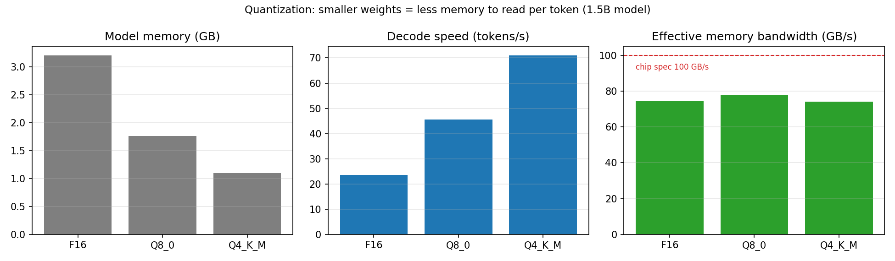
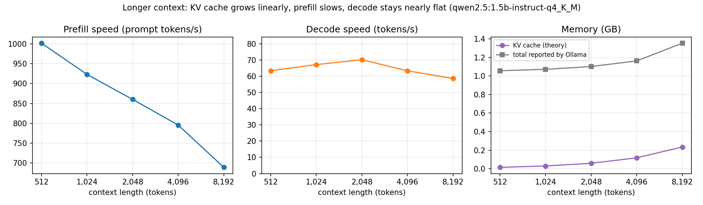

# LLM Inference Benchmark: Quantization, Context Length and Memory Bandwidth

Measures how a local LLM's **speed and memory** change with **quantization (FP16 → Q8 → Q4)** and **context length (512 → 8,192 tokens)** on a laptop, and shows that token generation is limited by **memory bandwidth**, which is the reason AI accelerators need high-bandwidth memory (HBM).

> 노트북에서 로컬 LLM(Ollama)의 양자화 수준과 컨텍스트 길이에 따른 추론 속도·메모리 사용량을 측정하는 프로젝트입니다. FP16→Q4 양자화로 모델 크기가 2.9배 줄자 생성 속도가 3.0배(23.6→71.1 tok/s) 빨라졌고, 실효 대역폭은 형식과 무관하게 74~78 GB/s로 일정했습니다. 토큰 생성 속도 × 모델 크기로 실효 메모리 대역폭을 추정해, LLM 추론이 연산이 아니라 메모리 대역폭에 의해 제한된다는 점과 HBM이 필요한 이유를 데이터로 보여줍니다.

## Why this matters

Generating one token requires reading **every weight of the model** from memory once. A 1.5B-parameter model in FP16 is about 3 GB, so 30 tokens/s means reading about 90 GB/s. That's close to what a laptop's memory can deliver, so compute is mostly waiting for memory. Shrinking the weights (quantization) or adding memory bandwidth (HBM, which SK hynix and Samsung build) are the two main ways to speed up generation. Long contexts add a second memory cost: the **KV cache**, which grows linearly with context length.

## What it measures

| Experiment | Varies | Fixed |
| --- | --- | --- |
| A. Quantization sweep | Same model at FP16, Q8_0, Q4_K_M | 1,024-token prompt, 128 output tokens |
| B. Context sweep | Prompt filling 512 → 8,192-token context | Q4_K_M model, 128 output tokens |

For each run (median of 3, after a warm-up, prompt cache defeated with a random prefix):

| Metric | Source |
| --- | --- |
| Prefill speed (prompt tokens/s) | Ollama `prompt_eval_count / prompt_eval_duration` |
| Decode speed (generated tokens/s) | Ollama `eval_count / eval_duration` |
| Time to first token | load time + prefill time |
| Model memory | Ollama `/api/ps` |
| KV cache (theory) | 2 × layers × KV heads × head size × tokens × 2 bytes, using the model's architecture from `/api/show` |
| Effective bandwidth | decode tokens/s × weight size in GB |

## Results

MacBook Air (Apple Silicon, 8 GB, about 100 GB/s memory bandwidth), Ollama, Qwen2.5-1.5B-Instruct. Median of 3 runs, one model loaded at a time.

**A. Quantization** (1,024-token prompt)

| Quantization | Memory (GB) | Decode (tok/s) | Prefill (tok/s) | Time to first token (s) | Effective bandwidth (GB/s) |
| --- | --- | --- | --- | --- | --- |
| FP16 | 3.21 | 23.6 | 1,022 | 0.90 | 74.4 |
| Q8_0 | 1.76 | 45.6 | 992 | 0.93 | 77.6 |
| Q4_K_M | 1.10 | **71.1** | 968 | 0.95 | 74.2 |

**B. Context length** (Q4_K_M)

| Context | Prompt tokens | Prefill (tok/s) | Time to first token (s) | Decode (tok/s) | KV cache, theory (GB) | Total memory (GB) |
| --- | --- | --- | --- | --- | --- | --- |
| 512 | 441 | 1,002 | 0.44 | 63.4 | 0.015 | 1.06 |
| 1,024 | 829 | 923 | 0.90 | 67.2 | 0.029 | 1.07 |
| 2,048 | 1,607 | 860 | 1.87 | 70.1 | 0.059 | 1.10 |
| 4,096 | 3,163 | 795 | 3.98 | 63.3 | 0.117 | 1.16 |
| 8,192 | 6,273 | 689 | 9.12 | 58.6 | 0.235 | 1.35 |




**What the results show**

1. **Token generation is memory-bound.** Going from FP16 to Q4 shrinks the model 2.9× (3.21 → 1.10 GB) and speeds up decoding 3.0× (23.6 → 71.1 tok/s). Speed tracks size almost exactly.
2. **The bandwidth stays the same.** Decode speed × model size comes out at **74–78 GB/s for all three formats**, about 75% of the chip's ~100 GB/s. Every generated token reads the whole model from memory, so memory bandwidth, not compute, sets the speed. This is why AI accelerators use HBM.
3. **Prompt processing is compute-bound.** Prefill stays near 1,000 tok/s whatever the quantization, because the whole prompt is processed in parallel and reuses each weight many times.
4. **Long context costs time and memory.** From 512 to 8,192 tokens the KV cache grows 16× (0.015 → 0.235 GB, linear as the formula predicts), total memory grows 28%, prefill slows 31%, and time to first token rises from 0.4 s to 9.1 s. Decode slows only slightly, because for this small model with grouped-query attention (2 KV heads) the cache is still small next to the weights.

Note: outputs were short (28–38 tokens), so decode speeds vary by a few tokens/s between runs. The ~4 tok/s difference between context 512 and 2,048 is within that noise.

**Lesson from the first run:** an earlier run produced speeds 10× lower because Ollama kept several models loaded at once and the 8 GB Mac started swapping. The script now unloads all models before each measurement. On memory-limited devices, measurement setup matters as much as the model.

## How to run

```bash
# 1. Install Ollama from https://ollama.com and open the app
# 2. Run the benchmark (models download automatically the first time, about 5 GB total)
pip install -r requirements.txt
python src/bench.py --bandwidth 100       # put your chip's bandwidth here
```

On a 16 GB+ Mac you can also try a 7B model:
`python src/bench.py --models qwen2.5:7b-instruct-fp16 qwen2.5:7b-instruct-q8_0 qwen2.5:7b-instruct-q4_K_M --context-model qwen2.5:7b-instruct-q4_K_M`

Tests use a fake Ollama server, so they run anywhere: `pytest -q`

## Project structure

```
src/bench.py          experiments, KV-cache math, bandwidth estimate
src/plot.py           charts
src/ollama_client.py  tiny standard-library client for the local Ollama API (no API key)
tests/                fake Ollama server + end-to-end test
results/              CSVs, results.json, charts
```
